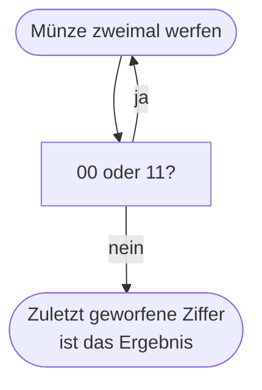
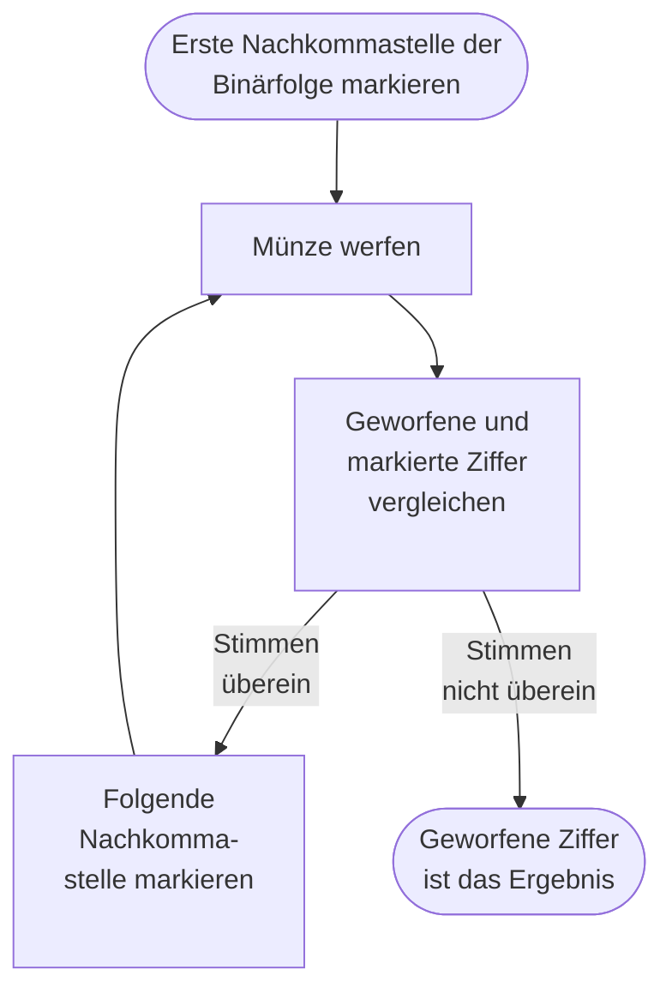
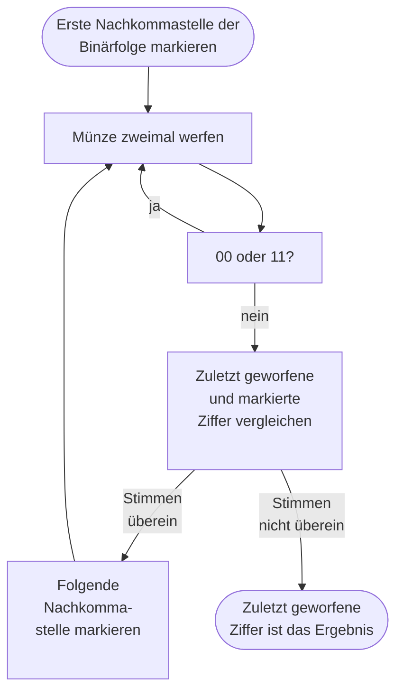

## Faire Münze mit gezinkter Münze simulieren 

Hat man nur eine gezinkte oder eine möglicherweise gezinkte Münze zur Hand, kann man mit dieser trotzdem einen fairen Münzwurf simulieren.

Nehmen wir beispielhaft an, dass unsere Münze zu 70&nbsp;% auf Kopf landet. Die folgende Argumentation lässt sich jedoch genauso gut mit jeder anderen Wahrscheinlichkeit führen.

Werfen wir die Münze zweimal so erhalten wir die folgende Wahrscheinlichkeitesverteilung:

![[images/Münze_Baumdiagramm.png|300]]

Die Wahrscheinlichkeit für $Kopf, Zahl$ ist somit genauso groß, wie für $Zahl, Kopf$. Wir haben also zwei Ereignisse, die gleich wahrscheinlich sind, genau wie bei einem fairen Münzwurf. 

Sollte zweimal dasselbe geworfen werden, also $Kopf, Kopf$ oder $Zahl, Zahl$, so wirft man einfach erneut.

Im weiteren Verlauf wird die Seite $Kopf$ mit der Zahl $0$ identifiziert und die Seite $Zahl$ mit der Zahl $1$.

### Diagramm

## Beliebige Münze mit fairer Münze simulieren 

Andersherum lässt sich mithilfe einer fairen Münze auch eine gezinkte Münze simulieren. Die Wahrscheinlichkeit für $Kopf$ können wir dabei beliebig wählen.

Wir wollen beispielhaft eine Münze, die mit einer Wahrscheinlichkeit von $\frac{2}{7}$ $Kopf$ zeigt, simulieren.

Der Trick besteht darin, die gewünschte Wahrscheinlichkeit im Binärsystem zu schreiben: 
$$\frac{2}{7}=0,0100100100100\ldots_{2}$$

Nun wirft man die faire Münze und vergleicht das Ergebnis des 1. Wurfs mit der 1. Nachkommastelle der Binärfolge. 
Ist sie gleich, so geht man zur nächsten Nachkommastelle und vergleicht diese mit dem Ergebnis des folgenden Münzwurfs. 
Dies wiederholt man solange bis sich Nachkommastelle und Münzwurf unterscheiden. Das Ergebnis dieses Münzwurfs ist dann das Ergebnis der simulierten gezinkten Münzwurfs.
In unserem Beispiel erhält man so das Ergebnis $0$ (also $Kopf$) mit einer Wahrscheinlichkeit von $\frac{2}{7}$.

### Diagramm

### Beispiele

![[images/Gezinkte_Münze_Beispiele.png|600]]

### Erklärung

Um Verwirrungen vorzubeugen, werden im folgenden Abschnitt die Ergebnisse der fairen Münze in  **blau**  und die Ergebnisse der simulierten gezinkten Münze in  **rot**  geschrieben.

Schauen wir uns zunächst noch einmal die Binärfolge von oben an und machen uns klar, was die einzelnen Nachkommastellen bedeuten:

$$\begin{align*}
\frac{2}{7}&=0,0100100100100\ldots_{2}\\
&=0\cdot\left(\frac{1}{2}\right)^{1}+1\cdot\left(\frac{1}{2}\right)^{2}+0\cdot\left(\frac{1}{2}\right)^{3}+0\cdot\left(\frac{1}{2}\right)^{4}+1\cdot\left(\frac{1}{2}\right)^{5}+\\
&\phantom{=~}0\cdot\left(\frac{1}{2}\right)^{6}+0\cdot\left(\frac{1}{2}\right)^{7}+1\cdot\left(\frac{1}{2}\right)^{8}+0\cdot\left(\frac{1}{2}\right)^{9}+0\cdot\left(\frac{1}{2}\right)^{10}\ldots\\
&=1\cdot\left(\frac{1}{2}\right)^{2}+1\cdot\left(\frac{1}{2}\right)^{5}+1\cdot\left(\frac{1}{2}\right)^{8}+1\cdot\left(\frac{1}{2}\right)^{11}+\ldots\\
&=\left(\frac{1}{2}\right)^{2}+\left(\frac{1}{2}\right)^{5}+\left(\frac{1}{2}\right)^{8}+\left(\frac{1}{2}\right)^{11}+\ldots
\end{align*}
$$

Wir wollen nun zeigen, dass dies auch genau die Wahrscheinlichkeit ist, mit der gezinkten Münze eine $\textcolor{red}{0}$ zu werfen. 

Mit dem oben genannten Verfahren können wir mit der simulierten gezinkten Münze nur eine $\textcolor{red}{0}$ bekommen, wenn die Binärfolge eine $1$ zeigt. Dies ist nur beim 2. Wurf, 5. Wurf. 8. Wurf, 11. Wurf etc. der Fall. 
Wollen wir im 2. Wurf eine $\textcolor{cyan}{0}$ werfen, so muss auch der Wurf davor eine $\textcolor{cyan}{0}$ sein (ansonsten wäre der erste Wurf eine $\textcolor{red}{1}$ sein müssen). Die Wahrscheinlichkeit hierfür ist $\left(\frac{1}{2}\right)^{2}$. 
Wir könnten auch im 5. Wurf eine $\textcolor{cyan}{0}$ werfen. Auch hier müssten alle vorhergegangenen Würfe eine $\textcolor{cyan}{0}$ gewesen sein. Die Wahrscheinlichkeit für eine $\textcolor{cyan}{0}$ im 5. Wurf beträgt also $\left(\frac{1}{2}\right)^{5}$. 
Die Wahrscheinlichkeit für eine $\textcolor{cyan}{0}$ im 8. Wurf beträgt also $\left(\frac{1}{2}\right)^{8}$ usw.

Die Wahrscheinlichkeit für eine $\textcolor{red}{0}$ beträgt also wie gewollt:

$$\begin{align*}
P(\textcolor{red}{0})&=P(\textcolor{cyan}{0}\text{ im 2. Wurf}) + P(\textcolor{cyan}{0}\text{ im 5. Wurf}) + P(\textcolor{cyan}{0}\text{ im 8. Wurf}) + \ldots\\
&=\left(\frac{1}{2}\right)^{2}+\left(\frac{1}{2}\right)^{5}+\left(\frac{1}{2}\right)^{8}+\left(\frac{1}{2}\right)^{11}+\ldots\\
&=\frac{2}{7}
\end{align*}$$

**Quelle:** https://jeremykun.com/2014/02/12/simulating-a-biased-coin-with-a-fair-coin/

## Beliebige Münze mit beliebiger Münze simulieren 

Bringen wir beide Verfahren zusammen so können wir mit einer gezinkten Münze zunächst eine faire Münze simulieren, um mit dieser anschließend eine beliebige Münze zu simulieren.

>Wir können also mit jeder beliebigen Münze jede andere belibiege Münze simulieren.[^1]

### Diagramm

### Beispiel

![[images/Gezinkte_Münze_Beispiel.png]]

[^1]: Sofern die Münze nicht zu 100 % auf einer Seite landet.