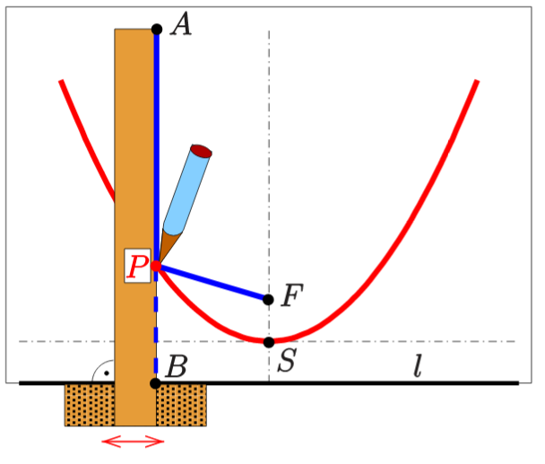
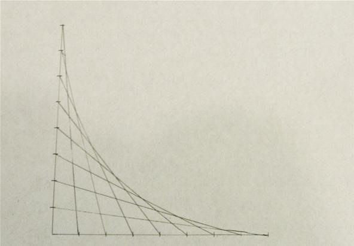

# Faden und Lineal

Geogebra: https://www.geogebra.org/m/MW8yC9Tv

# Falten

Quelle: [How to fold a parabola in a piece of paper](How%20to%20fold%20a%20parabola%20in%20a%20piece%20of%20paper.md)

# Strecken zwischen zwei Geraden zeichnen

Quelle: [Functions as lines between two axes](Functions%20as%20lines%20between%20two%20axes.md)

# Strecken in Koordinatensystem zeichnen

Quelle: [How to create parabolic curves using straight lines](How%20to%20create%20parabolic%20curves%20using%20straight%20lines.md)
