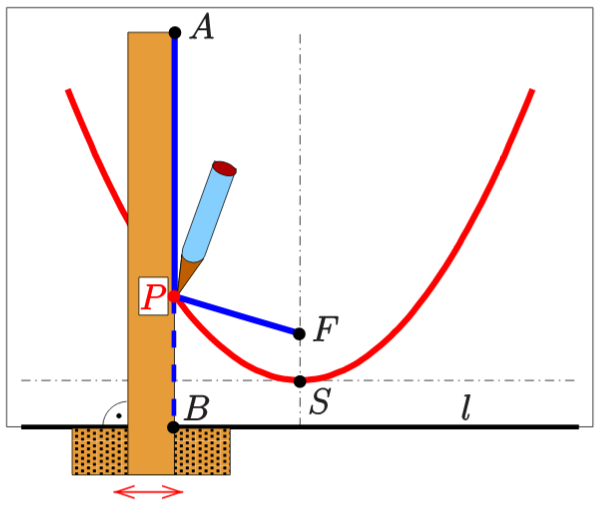
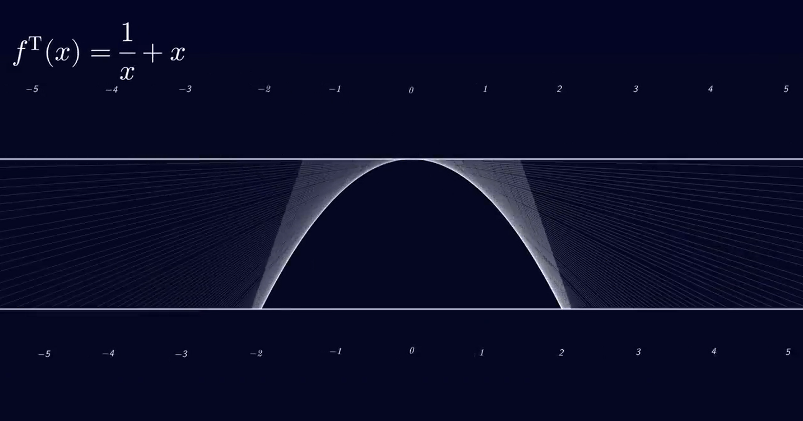
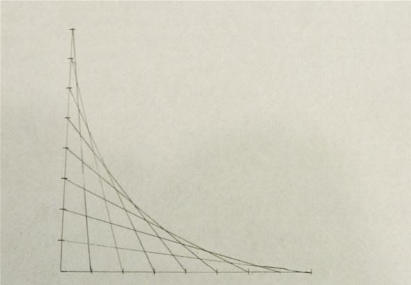

# Faden und Lineal

Geogebra: https://www.geogebra.org/m/MW8yC9Tv

# Falten

Quelle: https://twitter.com/matthen2/status/1326031733913874432
Erklärung: https://twitter.com/hagner_kyle/status/1536015559443288066#m

Zum Lösen von kubischen Gleichungen durch Falten siehe auch: [Parabeln falten und das Lösen von kubischen Gleichungen](Parabeln_falten_und_das_Lösen_von_kubischen_Gleichungen.md)

# Strecken zwischen zwei parallelen Geraden zeichnen

Quelle: https://www.youtube.com/watch?v=Pp47xzf4wGg

# Strecken in Koordinatensystem zeichnen

Quelle: https://mathcraft.wonderhowto.com/how-to/create-parabolic-curves-using-straight-lines-0131301
Mathematical paper: https://web.archive.org/web/20121120172948/http://faculty.plattsburgh.edu/gregory.quenell/pubpdf/stringart.pdf
