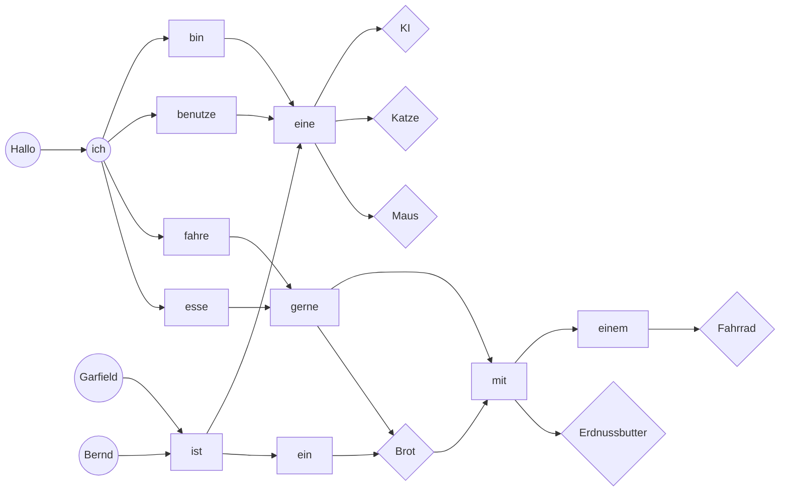

## Unterrichtsidee

Den Schülern soll anhand eines einfachen generativen Sprachmodells mithilfe von Markow-Ketten gezeigt werden, wie Computer Texte erstellen können.

Zuerst wird der [[#Datensatz]] mit den Kindern erschlossen und anschließend anhand eines [[#Graph|Graphen]] analysiert, welche Wörter aufeinander folgen. Das Sprachmodell "lernt" genau wie im Graphen dargestellt, welche Wörter einem bestimmten anderen Wort laut dem Datensatz folgen können und welche nicht. 
Durch zufällige Pfade durch den Graphen erstellt das Sprachmodell dann eigenständig neue Sätze.

Eine ähnliche Unterrichtsidee findet sich auch unter: https://www.herr-rau.de/wordpress/2019/06/markow-ketten-und-textgenerierung.htm

## Datensatz

Die Sätze, die das System als Datensatz bekommt sind die folgenden Sätze:

>Hallo, ich bin eine KI.
Garfield ist eine Katze.
Bernd ist ein Brot.
Ich benutze eine Maus.
Ich fahre gerne mit einem Fahrrad.
Ich esse gerne Brot mit Erdnussbutter.


## Graph

Die Verbindungen der einzelnen Wörter untereinander können in Form eines Graphen dargestellt werden.
Anfangswörter sind dabei kreisförmig, Endwörter rautenförmig.

Die Wörter können in der Schule auch mithilfe von Kärtchen im Klassenraum ausgelegt und verbunden werden.



## Python-Code

### Online

Code für den gezeigten Datensatz ist online einsehbar und ausführbar unter: https://replit.com/@nl_woorden/Satzegenerator

Der Code für das Generieren von Sätzen aus eigenem Datensatz findet sich unter: https://replit.com/@nl_woorden/Satzegenerator-mit-Eingabe (nicht für Mobilgeräte geeignet)

### Code für beliebigen Datensatz

Basierend auf dem [Blogartikel](https://web.archive.org/web/20180101140330/http://www.ramtin.xyz/post/4/) von Ramtin Alami.

```python
"""""""""""""""""""""""""""""""""""""""""""""
A line break is inserted after each "." in text.txt and output as result.txt.
"""""""""""""""""""""""""""""""""""""""""""""


with open("DATEIPFAD_ZUM_DATENSATZ.txt") as f:
    cont = f.read()
    
char = list(cont)

for i in range(len(char)):
    if char[i] == ".":
        char[i] = " .\n"
    elif char[i] == "!":
        char[i] = " !\n"
    elif char[i] == "?":
        char[i] = " ?\n"

with open("DATEIPFAD_ZUM_ORDNER_IN_DEM_DER_DATENSATZ_LIEGT\\result.txt","w") as f:
    f.write("".join(char))


"""""""""""""""""""""""""""""""""""""""""""""
Here the generation of the random sentences begins!
"""""""""""""""""""""""""""""""""""""""""""""


text = open("DATEIPFAD_ZUM_ORDNER_IN_DEM_DER_DATENSATZ_LIEGT\\result.txt")
model = {}

# Dictionary is created with each word as a key and as values all words that follow the key word
for line in text:
    line = line.lower().split()
    for i, word in enumerate(line):
        if i == len(line)-1:   
            model['END'] = model.get('END', []) + [word]
        else:    
            if i == 0:
                model['START'] = model.get('START', []) + [word]
            model[word] = model.get(word, []) + [line[i+1]]

#print(model)
          
import random 

# Random sentences are generated
i = 0
while i < 10:# anzahl sätze
    generated = []
    while True:
        if not generated:
            words = model['START']
        elif generated[-1] in model['END']:
            break
        else:
            words = model[generated[-1]]
        generated.append(random.choice(words))
    if len(generated) >= 3 and len(generated) <= 15:# anzahl wörter in jedem satz
     , print(generated)
      satz = " ".join(generated)
      satz = satz.replace(" .",".")
      satz = satz.replace(" !","!")
      satz = satz.replace(" ?","?")
      print(satz)
      i += 1

text.close()
```

### Code für den oben angegebenen Datensatz

```python

model = {'START': ['hallo,', 'garfield', 'ich', 'ich', 'ich', 'bernd'], 'hallo,': ['ich'], 'ich': ['bin', 'benutze', 'fahre', 'esse'], 'bin': ['eine'], 'eine': ['ki', 'katze', 'maus'], 'ki': ['.'], 'END': ['.', '.', '.', '.', '.', '.'], 'garfield': ['ist'], 'ist': ['eine', 'ein'], 'katze': ['.'], 'benutze': ['eine'], 'maus': ['.'], 'fahre': ['gerne'], 'gerne': ['mit', 'brot'], 'mit': ['einem', 'erdnussbutter'], 'einem': ['fahrrad'], 'fahrrad': ['.'], 'esse': ['gerne'], 'brot': ['mit', '.'], 'erdnussbutter': ['.'], 'bernd': ['ist'], 'ein': ['brot']}

import random 

# Random sentences are generated
i = 0
while i < 10:# anzahl sätze
    generated = []
    while True:
        if not generated:
            words = model['START']
        elif generated[-1] in model['END']:
            break
        else:
            words = model[generated[-1]]
        generated.append(random.choice(words))
    if len(generated) >= 3 and len(generated) <= 15:# anzahl wörter in jedem satz
     , print(generated)
      satz = " ".join(generated)
      satz = satz.replace(" .",".")
      satz = satz.replace(" !","!")
      satz = satz.replace(" ?","?")
      print(satz)
      i += 1
```